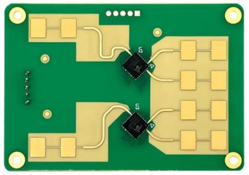
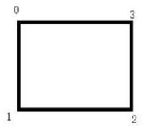



Shenzhen Hailingke Electronics Co., Ltd.

https://www.hlktech.net/index.php?id=1185

**HLK-LD2461**

Serielles Kommunikationsprotokoll des Moduls zur Erkennung und Verfolgung beweglicher Ziele.

- [1. Protokolldatenformat](#1-protokolldatenformat)
  - [1.1. Frame](#11-frame)
- [2. Syntax](#2-syntax)
  - [2.1. Änderung der Baudrate,  0x01](#21-änderung-der-baudrate--0x01)
  - [2.2. Versionsnummer / eindeutige ID, 0x09](#22-versionsnummer--eindeutige-id-0x09)
  - [2.3. Werkseinstellungen wiederherstellen, 0x0A](#23-werkseinstellungen-wiederherstellen-0x0a)
  - [2.4. Bereiche definieren, 0x04](#24-bereiche-definieren-0x04)
  - [2.5. Bereiche entfernen, 0x05](#25-bereiche-entfernen-0x05)
  - [2.6. Bereiche lesen, 0x06](#26-bereiche-lesen-0x06)
  - [2.7. Berichtsformat setzen, 0x02](#27-berichtsformat-setzen-0x02)
  - [2.8. Berichtsformat lesen, 0x03](#28-berichtsformat-lesen-0x03)
  - [2.9. Radarbericht, 0x07,0x08](#29-radarbericht-0x070x08)

# 1. Protokolldatenformat

Die Datenkommunikation über die serielle Schnittstelle des LD2461 verwendet das Big-Endian-Format.  
Alle Daten in der folgenden Tabelle sind hexadezimal.

Senderichtung ist Host -> Modul.

## 1.1. Frame

Befehlsrahmenformat in die Senderichtung.

| Frame-Header | Datenlänge | Befehlswort | Befehlswert | Prüfsumme | Frame-Ende |
| ------------ | ---------- | ----------- | ----------- | --------- | ---------- |
| FF EE DD     | 2 Bytes    | 1 Byte      | N Bytes     | 1 Byte    | DD EE FF   |

Format eines Befehlsrahmen für die Rückgaben des Protokolls.

| Frame-Header | Datenlänge | Befehlswort | Rückgabewert | Prüfsumme | Frame-Ende |
| ------------ | ---------- | ----------- | ------------ | --------- | ---------- |
| FF EE DD     | 2 Bytes    | 1 Byte      | N Bytes      | 1 Bytes   | DD EE FF   |

Beschreibung der Felder:

Datenlänge: 2 Byte, Befehlswortlänge + Befehlswertlänge

Prüfsumme: 1 Byte, Befehlswort + Befehlswert, nehmen Sie die unteren 8 Bits der akkumulierten Summe. 
Beispiel: Nehmen wir an, die Summe Befehlswort + Befehlswert ergeben 0x3068.
Die Prüfsumme beträgt dann 68.

Befehlswert: N Bytes. 
Die Anzahl der vom Befehlswert jedes Befehls belegten Bytes ist unterschiedlich. 
Die spezifische Länge hängt von jedem Befehl unten ab.

# 2. Syntax

## 2.1. Änderung der Baudrate,  0x01

Standardwert ist 9600 baud. 

Achtung: Nach dem Senden dieses Befehls wird er sort wirksam und die Baudrate der seriellen Schnittstelle ändert sich auf den angegebenen Wert. 

Befehlswort: 0x01

Befehlswert: 3-Byte-Baudratenwert der seriellen Schnittstelle

Beispiel für einen Befehlswert, der der Baudrate der seriellen Schnittstelle entspricht (Baudraten Bereich der seriellen Schnittstelle 9600–256000)

| Befehlswert | Baudrate | Kommentar  |
| ----------- | -------- | ---------- |
| 0x002580    | 9600     | (Standard) |
| 0x004B00    | 19200    |            |
| 0x009600    | 38400    |            |
| 0x00E100    | 57600    |            |
| 0x01C200    | 115200   |            |
| 0x03E800    | 256000   |            |

**Daten senden** 

Ändern Sie die Baudrate der seriellen Schnittstelle auf 115200.

| Header   | Length | Command | Payload  | Check | Footer   |
| -------- | ------ | ------- | -------- | ----- | -------- |
| FF EE DD | 00 04  | 01      | 01 C2 00 | C4    | DD EE FF |

FF EE DD 00 04 01 01 C2 00 C4 DD EE FF

FF EE DD 00 04 01 03 E8 00 EB DD EE FF

**Empfangen**

Rückgabewert: 1 Byte (0 schlägt fehl, 1 ist erfolgreich)

Daten zurückgeben (Erfolg)

| Header   | Length | Command | Payload | Check | Footer   |
| -------- | ------ | ------- | ------- | ----- | -------- |
| FF EE DD | 00 02  | 01      | 01      | 02    | DD EE FF |

## 2.2. Versionsnummer / eindeutige ID, 0x09

Nur Abfrage, nach dem Senden werden die aktuelle Versionsnummer und die eindeutige ID des Moduls zurückgegeben.

**Daten Senden**

Befehlswort: 0x09

Befehlswert: 0x01

Daten senden (aktuelle Modulversionsnummer, ID abfragen)

| Header   | Length | Command | Payload | Check | Footer   |
| -------- | ------ | ------- | ------- | ----- | -------- |
| FF EE DD | 00 02  | 09      | 01      | 0A    | DD EE FF |

**Daten Empfangen**

Rückgabewert: 4 Byte Versionsnummer + 4 Byte ID-Nummer

Die Versionsnummer beträgt 4 Bytes, das 1. Byte (Jahr und Monat), das 2. Byte (Tag), das 3. Byte (Hauptversion), das 4. Byte Bytes (Nebenversion). 
Gelistet als 15 20 00 01, die Versionsnummer ist Version 0.1 vom 20. Mai 2021

Rückgabe Daten (Versionsnummer ist Version 0.1 vom 1. November 2023)

| Header   | Length | Command | Payload                 | Check | Footer   |
| -------- | ------ | ------- | ----------------------- | ----- | -------- |
| FF EE DD | 00 09  | 09      | 3B 01 00 01 5C 5A D5 56 | 27    | DD EE FF |

## 2.3. Werkseinstellungen wiederherstellen, 0x0A

Wiederherstellen des standardmäßigen nicht Partitions Modus (ohne Zurücksetzen der Baudrate der seriellen Schnittstelle).

Befehlswort: 0x0A

Befehlswert: 0x01

Rückgabewert: 1 Byte (0 schlägt fehl, 1 ist erfolgreich)

**Daten senden**

| Header   | Length | Command | Payload | Check | Footer   |
| -------- | ------ | ------- | ------- | ----- | -------- |
| FF EE DD | 00 02  | 0A      | 01      | 0B    | DD EE FF |

**Empfange Daten**

| Header   | Length | Command | Payload | Check | Footer   |
| -------- | ------ | ------- | ------- | ----- | -------- |
| FF EE DD | 00 02  | 0A      | 01      | 0B    | DD EE FF |

## 2.4. Bereiche definieren, 0x04

Legen Sie den angegebenen Bereich so fest, dass nur Ziele erkannt oder nicht erkannt werden. Es können bis zu 3 Bereiche eingestellt werden.

Befehlswort: 0x04

Befehlswert: n-ter Blockbereich + x0 y0 x1 y1 x2 y2 x3 y3 + Bereich Typ 

Bereichsnummer, 1 Byte

1 Block: 1 
2 Block: 2 
3 Block: 3 

Bereichskoordinaten, 8 Bytes

Das Koordinatenwertformat ist int8 Typ x, y; Multiplizieren Sie jeweils mit 10.
Es gibt insgesamt 4 Scheitelpunkte, die Koordinaten jedes Scheitelpunkts belegen 2 Bytes

In der Abbildung unten sind 0,1,2,3 der Reihe nach eingestellt.

Bereichstyp, 1 Byte

0x00 erkennt nur Ziele innerhalb des Bereichs 
0x01 Keine Ziele in der Umgebung erkennen 

**Daten senden**

Ersten Bereich festlegen (1), die Koordinaten jedes Scheitelpunkts sind (-0.5, 2), (-0.5, 1), (0.5, 1), (0.5, 2).  
Ziele in diesem Bereich sollen erkannt werden.

| Header   | Length | Command | Payload                       | Check | Footer   |
| -------- | ------ | ------- | ----------------------------- | ----- | -------- |
| FF EE DD | 00 0B  | 04      | 01 FB 14 FB 0A 05 0A 05 14 00 | 41    | DD EE FF |

**Daten empfangen**

Rückgabewert: 3 Bytes, 1 Byte Bereichsnummer + 1 Byte Bereichstyp + 1 Byte Ergebnis (0 Fehler, 1 Erfolg) 

Daten zurückgeben

| Header   | Length | Command | Payload  | Check | Footer   |
| -------- | ------ | ------- | -------- | ----- | -------- |
| FF EE DD | 00 04  | 04      | 01 00 01 | 06    | DD EE FF |

## 2.5. Bereiche entfernen, 0x05

Wählen Sie diese Option, um die regionale Filterfunktion einer Einstellung zu entfernen.

Befehlswort: 0x05

Befehlswert: 1 Byte Bereichsnummer

**Daten senden** 

Filtereinstellungen im Bereich 1 aufheben.

| Header   | Length | Command | Payload | Check | Footer   |
| -------- | ------ | ------- | ------- | ----- | -------- |
| FF EE DD | 00 02  | 05      | 01      | 06    | DD EE FF |

**Daten zurückgeben**

Rückgabewert: 1 Byte Bereichsnummer + 1 Byte Einstellungsergebnis (0 schlägt fehl, 1 ist erfolgreich)

| Header   | Length | Command | Payload | Check | Footer   |
| -------- | ------ | ------- | ------- | ----- | -------- |
| FF EE DD | 00 03  | 05      | 01 01   | 07    | DD EE FF |

## 2.6. Bereiche lesen, 0x06

Befehlswort: 0x06

Befehlswert: 0x01

**Daten senden**

| Header   | Length | Command | Payload | Check | Footer   |
| -------- | ------ | ------- | ------- | ----- | -------- |
| FF EE DD | 00 02  | 06      | 01      | 07    | DD EE FF |

**Daten empfangen**

Rückgabewert: Bereich Nr. 1 (1 Byte) + Bereichstyp (1 Byte) + Bereichskoordinaten (8 Byte) + Bereich Nr. 2 (1Byte) + Bereichstyp (1 Byte) + Bereichskoordinaten (8 Bytes) + Bereich Nr. 3 (1 Byte) + Bereichstyp (1 Byte) + Bereichskoordinaten (8 Bytes)

Rückgabe Daten:

Die Länge und Breite des ersten und dritten Bereichs des Radars betragen jeweils 1 m und die Koordinaten sind (-2, 2), (-2, 1), (-1, 1), (-1, 2) und (1, 2),(1, 1),(2, 1),(2, 2).  
Bereich 1 ist der Bereich zur Erkennung bewegter Ziele, Bereich 3 ist der Bereich zur Abschirmung bewegter Ziele.

| Header   | Length | Command | Payload | Check | Footer   |
| -------- | ------ | ------- | ------- | ----- | -------- |
| FF EE DD | 00 1F  | 06      | Payload | 85    | DD EE FF |

Payload Content:

| Bereich | Type | Corner                  |
| ------- | ---- | ----------------------- |
| 01      | 00   | EC 14 EC 0A F6 0A F6 14 |

| Bereich | Type | Corner                  |
| ------- | ---- | ----------------------- |
| 02      | 00   | 00 00 00 00 00 00 00 00 |

| Bereich | Type | Corner                  |
| ------- | ---- | ----------------------- |
| 03      | 01   | 0A 14 0A 0A 14 0A 14 14 |

## 2.7. Berichtsformat setzen, 0x02

Ändern Sie das Format der Radarberichtsdaten.  
Standardmäßig wird nur angezeigt, ob sich Ziele in der Umgebung befinden.

Befehlswort: 0x02

Befehlswert: 1 Byte

Befehlswertdefinition:

0x01 bedeutet, dass nur Punktkoordinatenwerte angezeigt werden

0x02 bedeutet, dass nur angezeigt wird, ob sich ein Ziel in der Umgebung befindet

0x03 stellt den Koordinatenwert des Anzeigepunkts dar und gibt an, ob sich in der Umgebung ein Ziel befindet

**Daten senden**

Koordinatenwert des Anzeigepunkts festlegen.

| Header   | Length | Command | Payload | Check | Footer   |
| -------- | ------ | ------- | ------- | ----- | -------- |
| FF EE DD | 00 02  | 02      | 01      | 03    | DD EE FF |

**Empfange Daten**

Rückgabewert: 1 Byte (0 schlägt fehl, 1 ist erfolgreich)

| Header   | Length | Command | Payload | Check | Footer   |
| -------- | ------ | ------- | ------- | ----- | -------- |
| FF EE DD | 00 02  | 02      | 01      | 03    | DD EE FF |

## 2.8. Berichtsformat lesen, 0x03

Lesen Sie das Format der aktuellen vom Radar gemeldeten Daten

Befehlswort: 0x03

Befehlswert: 0x01

Rückgabewert: 1-Byte-Radar-Berichtsformat 
Details zum Status finden Sie in der Befehlswertdefinition "Berichtsformat setzen". 

**Daten senden**

| Header   | Length | Command | Payload | Check | Footer   |
| -------- | ------ | ------- | ------- | ----- | -------- |
| FF EE DD | 00 02  | 03      | 01      | 04    | DD EE FF |
 
**Daten zurückgeben**

| Header   | Length | Command | Payload | Check | Footer   |
| -------- | ------ | ------- | ------- | ----- | -------- |
| FF EE DD | 00 02  | 03      | 01      | 04    | DD EE FF |

## 2.9. Radarbericht, 0x07,0x08

Das Modul meldet aktiv Daten und das Format des gemeldeten Inhalts wird durch den Parameter "Berichtsformat" beeinflusst.

Befehlswort: 0x07 und 0x08

Befehlswert: siehe Tabelle unten

Rückgabewert: XX

Das Radarberichtsformat entspricht dem Befehlswort:

| Format | Befehlswort | Befehlswert                                  |
| ------ | ----------- | -------------------------------------------- |
| 0x01   | 0x07        | x- und y-Koordinaten verschiedener Bereiche. |
| 0x02   | 0x08        | 1 jemand, 0 niemand                          |

**Daten empfangen** 

Radarberichtsformat ist 0x02.

| Header   | Length | Command | Payload | Check | Footer   |
| -------- | ------ | ------- | ------- | ----- | -------- |
| FF EE DD | 00 04  | 08      | payload | 0A    | DD EE FF |

Payload:

| Bereich 1 | Bereich 2 | Bereich 3 |
| --------- | --------- | --------- |
| 01        | 00        | 01        |

Es gibt ein Ziel in Bereich 1, es gibt kein Ziel in Bereich 2 und es gibt ein Ziel in Bereich 3.

Radarberichtsformat ist 0x01. 

X-Koordinatenwert von Ziel 1 + Y-Koordinatenwert von Ziel 1 + X-Koordinatenwert von Ziel 2 Koordinatenwert + Y-Koordinatenwert von Ziel 2.

Die Berechnungsmethode für den Koordinatenwert ist dieselbe wie die Koordinatenberechnungsmethode in Bereichsfilterung.

| Header   | Length | Command | Payload | Check | Footer   |
| -------- | ------ | ------- | ------- | ----- | -------- |
| FF EE DD | 00 05  | 07      | payload | 25    | DD EE FF |

Payload: 

| Ziel 1  Koordinate | Ziel 2 Koordinate |
| ------------------ | ----------------- |
| F1 0F              | 0F 0F             |
